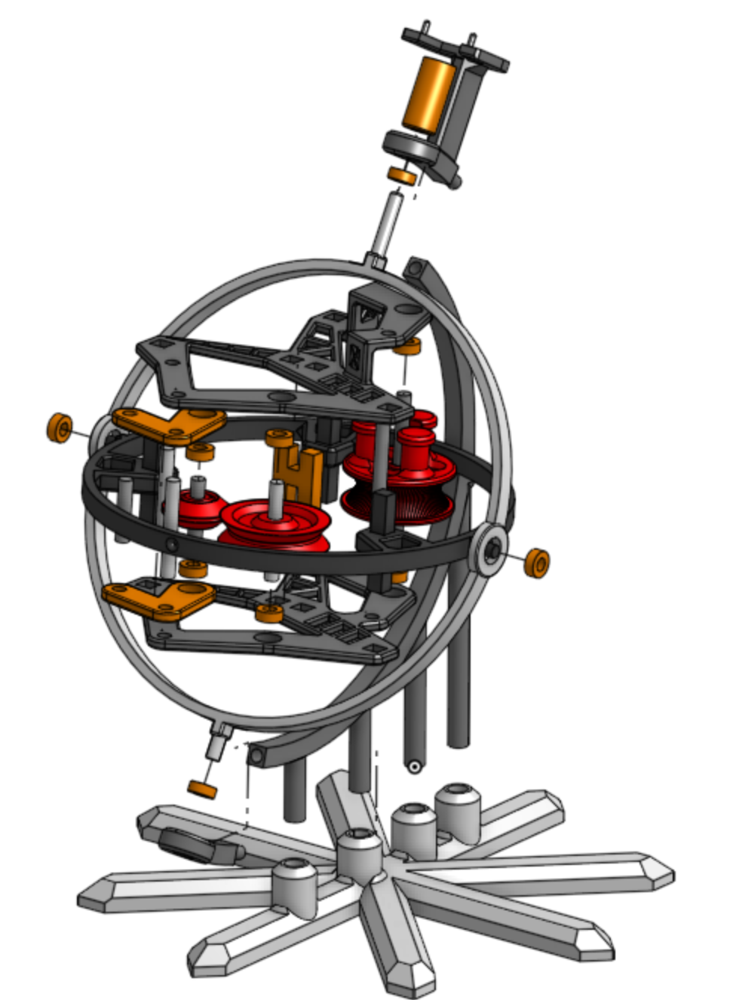
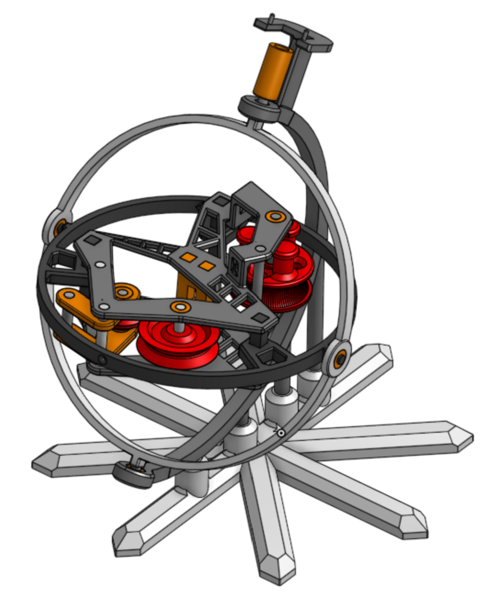

# Gymtracker – Gyro Mechanism

Proof-of-concept gyroscope-inspired mechanism for tracking barbell movement during strength training.

**Onshape (live, in browser):** [Open document](https://cad.onshape.com/documents/c535fe041c3fea1dd44a1564/w/38736744df0b7e2c5cb764f5/e/57398b332f15f7999b63c291?renderMode=0&uiState=6abd3b5ed1c493cddff93216)
**CAD download (STEP, Fusion-compatible):** [Assembly](CAD/GymTracker_assembly.step)

## Problem
Tracking the 3D path of a barbell usually requires cameras or IMUs, which are either impractical or tend to drift. This mechanism measures the bar position directly: a string attached to the barbell is guided through two gimbal-style rotating frames, and rotary encoders capture two angles plus the string extension. Together they define the bar position in spherical coordinates. All parts are designed for 3D printing.

## Structure
21 unique parts: 20 custom-designed components and 1 standard part (ball bearing).
The assembly contains 35 part instances in total, including 10 identical ball bearings; several custom parts are reused.

| Module | Parts | Function |
|---|---|---|
| Outer frame | 7 | Rotatably supports the mechanism; measures the first string angle (yaw) |
| Inner frame | 4 | Measures the second string angle (pitch) |
| Center frame | 24 | Measures the string extension |

## Design Decisions
- **Manufacturing:** FDM, to allow rapid prototyping iterations.
- **Tilted base:** To allow a longer vertical movement range.
- **Kinematics:** Two rotational degrees of freedom implemented as revolute mates: yaw range 350° (limited by the outer frame), pitch range 170° (limited by the rotary mate of the inner frame).
- **Bearing arrangement:** Each rotating frame is supported by ball bearings to minimise friction, since friction would distort the string angle measurement.
- **Tolerances / Assembly:** 0.1 mm clearance to compensate for print inaccuracy. Assembled from the inside out.

## Lessons learned
Splitting the modules further would reduce complexity, make it easier to test tolerances on small test prints, and allow faster prototyping iterations.
